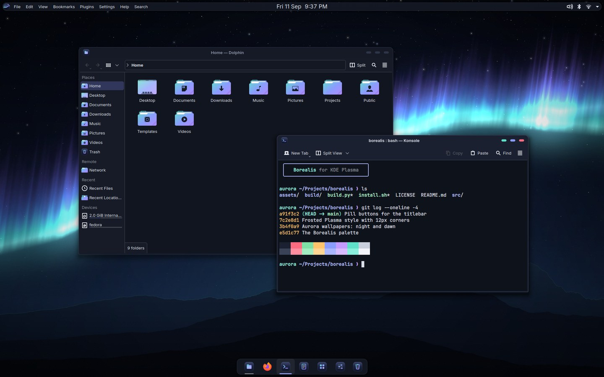
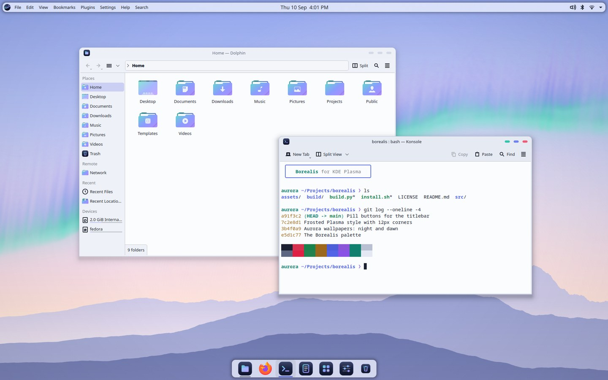
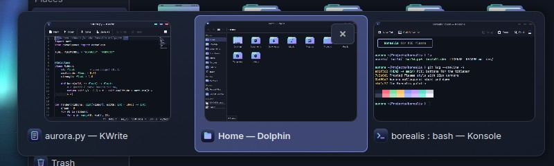
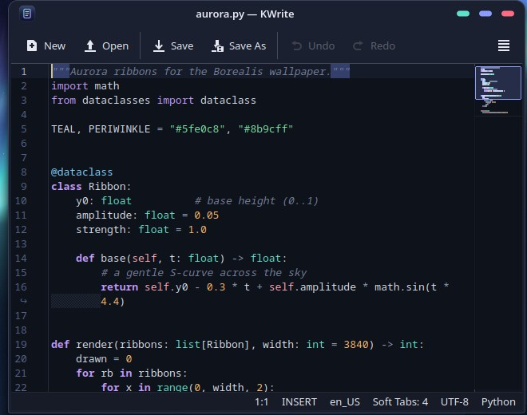
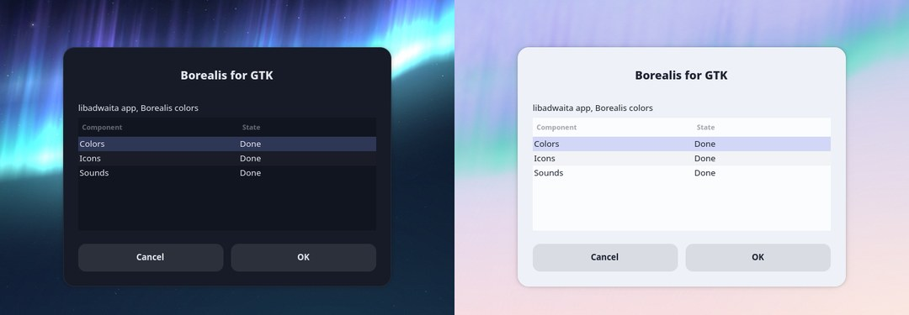
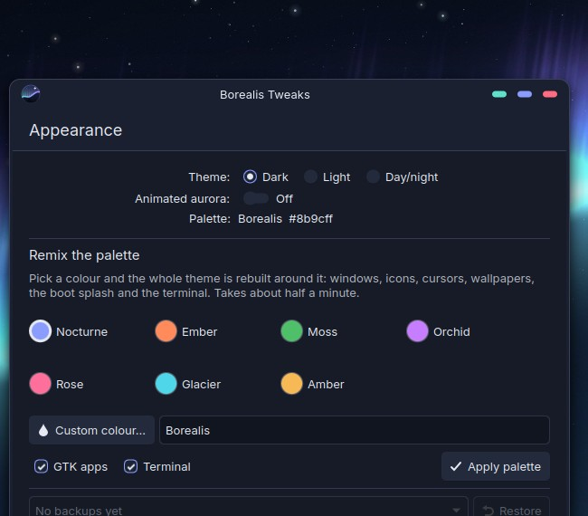

# Borealis — a Global Theme for KDE Plasma 6

Aurora over the mountains: ink-navy nights and polar-dawn days, periwinkle and
aurora-teal accents, frosted 12 px surfaces and pill-shaped titlebar buttons.
Built for Fedora 44 / Plasma 6.7.

| Borealis Dark | Borealis Light |
|---|---|
|  |  |

| Alt+Tab switcher | Kate / KWrite |
|---|---|
|  |  |



| Borealis Tweaks |
|---|
|  |

## What's inside

| Component | Name(s) | Notes |
|---|---|---|
| Global Themes | **Borealis Dark**, **Borealis Light** | A pair for Plasma's automatic day/night switching |
| Color schemes | BorealisDark, BorealisLight | Every text color meets WCAG AA (4.5:1) — `tools/contrast.py` checks it |
| Plasma Style | Borealis | Frosted (≈80 % + blur), 12 px corners, pill task indicators, Borealis checkboxes, radios, switches, aurora progress bars and spinner |
| Window decoration | Borealis-Dark / -Light (Aurorae) | Teal · periwinkle · rose pills; glyphs appear on hover |
| Task switcher | built into each Global Theme | Frosted card of rounded window previews (Alt+Tab) |
| Wallpaper | Borealis | Procedural aurora: *night* (dark) and *dawn* (light) |
| Animated wallpaper | Borealis Aurora | GPU-shader aurora + twinkling stars, for desktop **and lock screen**; pauses behind maximized windows, eases off on battery, and can follow the **real** aurora |
| Cursors | Borealis Snow (dark), Borealis Ink (light) | SVG cursors + Xcursor fallbacks, aurora spinner |
| Icons | Borealis-Dark / -Light | Aurora-gradient folders, squircle icons for common apps, Borealis logo — on top of **Tela** |
| Sounds | Borealis | Soft glassy chimes (E-major pentatonic) for login, notifications, devices, battery… |
| Fonts | Inter + JetBrains Mono | Set by the Global Themes (install the fonts first, see below) |
| Splash screen | built into each Global Theme | Logo, wordmark and an aurora progress bar |
| Boot splash | Borealis (Plymouth) | Same logo and aurora spinner from power-on |
| Desktop layout | built into each Global Theme | Floating top bar (launcher, global menu, centered clock, tray) + floating dock |
| Konsole / Kate | Borealis Dark / Light | Terminal schemes + profiles, editor themes |
| Tweaks app | **Borealis Tweaks** | Switch variant, remix the palette onto any colour, toggle the animated aurora, undo |
| Command line | bat, tmux, git, `ls`, fzf, bash prompt | One palette for the terminal's contents too (`--terminal`) |
| GTK4 / libadwaita | `borealis-libadwaita.css` | Borealis surfaces and the exact accent for GNOME apps, light/dark live (GTK3 apps already follow via Breeze-GTK) |

## Install

```bash
sudo dnf install rsms-inter-fonts jetbrains-mono-fonts   # optional but intended
./install.sh
```

`./install.sh` copies everything into `~/.local/share` without changing your
current look. Then choose **Borealis Dark** or **Borealis Light** in *System
Settings › Colors & Themes › Global Theme*. Tick *Desktop and window layout*
only if you want the top bar + dock (it replaces your current panels).

Or apply from the terminal — it backs up your settings first and prints the undo command:

```bash
./install.sh --apply dark --live
```

| Option (with `--apply`) | Effect |
|---|---|
| `--layout` | also use the Borealis panels |
| `--auto` | Borealis Light by day, Borealis Dark at night |
| `--live` | animated aurora on the desktop and lock screen |
| `--konsole` | make the Borealis profile Konsole's default |
| `--gtk` | Borealis colors for GTK4/libadwaita apps |
| `--flatpak` | same for Flatpak apps (implies `--gtk`; gives every Flatpak read-only access to `~/.config/gtk-4.0`) |
| `--terminal` | bat, tmux, git, `ls`, fzf and prompt colors (adds one line to `~/.bashrc`) |

`--apply` also sets the Borealis wallpaper on the lock screen (Fedora otherwise
pins its own) and switches to the Borealis sound theme.

To undo: `./uninstall.sh --restore ~/.local/state/borealis-backup/<timestamp>`.
To remove the files: switch to another Global Theme, then `./uninstall.sh --remove`.

### Animated wallpaper

*Desktop › Configure Desktop and Wallpaper › Wallpaper type › Borealis Aurora*
(and the same under *Screen Locking › Appearance*). Settings: sky (follow the
color scheme / always night / always dawn), speed, brightness, twinkling, frame
rate, and the power savers. It renders the aurora at half resolution and ~24 fps,
stops completely behind maximized/fullscreen windows and when animations are
turned off, and on battery slows to 10 fps (or pauses, or keeps going — your
choice). On the lock screen it runs at most 15 fps, because Plasma re-renders
the wallpaper through a blur there.

### Real aurora activity

*Wallpaper settings › Real aurora › Follow tonight's actual activity.* The
wallpaper then asks NOAA's space weather service for the planetary K-index
every 20 minutes and scales the aurora to match: barely there on a quiet night,
blazing during a storm. It can also notify you when the index reaches 5, which
is roughly when an aurora becomes visible at mid latitudes. This is the only
part of Borealis that uses the network, it is off by default, and it sends
nothing but the request.

### Day/night switching

*Global Theme* › **Switch to Dark Mode at Night** (Light: Borealis Light, Dark:
Borealis Dark) and *Configure Day/Night Cycle…* — or `./install.sh --apply dark --auto`.

### Login screen and boot splash (need root)

```bash
sudo ./install-system.sh              # system-wide copies for the login screen
sudo ./install-system.sh --plymouth   # also the Borealis boot splash (rebuilds the initramfs)
```

Then *System Settings › Login Screen* › **Apply Plasma Settings…** and, under
**Configure Appearance…**, pick an image from `/usr/local/share/wallpapers/Borealis/`.
`sudo ./install-system.sh --remove` undoes the copies;
`sudo ./install-system.sh --plymouth-revert` restores the previous boot splash.

### Konsole and Kate

- Konsole: *Settings › Manage Profiles* › **Borealis Dark** › *Set as Default* (or `--konsole`).
- Kate/KWrite: *Settings › Configure › Appearance › Color Theme* › **Borealis Dark** / **Borealis Light**.

## Notes

- **Window borders** follow *Window Decorations › Border size* (4 px at Normal).
  Bottom corners stay nearly square: KWin doesn't round window contents.
- **Icons** need Tela (in `~/.local/share/icons`); without it Borealis falls
  back to Breeze and keeps its folders, app icons and logo.
- **Lock screen**: Plasma 6.7 doesn't let Global Themes replace its layout;
  Borealis styles it through colors, Plasma Style and the (animated) wallpaper.
  Plasma always draws the lock-screen clock in white, so the light variant uses
  a dimmed copy of the dawn wallpaper (`Borealis-Lock`) to keep it readable.

## Rebuild / customize

Everything is generated from Python (PIL, pycairo, librsvg via GObject; Qt's
`qsb` compiles the shaders; `ffmpeg` encodes the sounds):

```bash
./build.py                  # everything → build/share
./build.py plasmastyle      # or one step: colors apps cursors wallpaper plasmastyle
                            #   aurorae icons sounds live plymouth gtk terminal lnf
tools/check.py              # QML, SVG, JSON, package, Plymouth and WCAG checks
tools/contrast.py           # just the WCAG audit, pair by pair
tools/testsession.py dark   # screenshots from an isolated, off-screen Plasma session
tools/package.py            # KDE Store archives → dist/ (see STORE.md)
```

With `make` installed, `make`, `make check`, `make test`, `make package` and
`make apply` wrap the same scripts.

Palette, radii and translucency live in `src/tokens.py`.

### Borealis Tweaks (the app)

`install.sh` also installs a small app — look for **Borealis Tweaks** in your
launcher. It switches between Dark, Light and day/night, turns the animated
aurora on or off, rebuilds the whole theme around a colour you pick (seven
presets or a custom colour), and restores any earlier backup. The heavy lifting
is the same `build.py` and `install.sh` used here, so anything it does can be
undone from the terminal. It needs PySide6 (`sudo dnf install python3-pyside6`).

### Remix it onto another accent

```bash
./build.py --accent "#ff8a5b" --name "Borealis Ember" --out ~/ember/share
./install.sh --from ~/ember/share
```

Every colour — surfaces, decorations, icons, cursors, both wallpapers, the
animated aurora, splash, boot splash, terminal kit and GTK CSS — is rotated
around the colour wheel by the angle between your accent and Borealis's
periwinkle, and the accent itself appears exactly as given (nudged only if it
would fail contrast). Red, amber and green keep their meaning. The remix gets
its own package names, so it installs next to the original and both show up in
the Global Theme list. `--saturation 1.2` makes everything more vivid.

## Links

Source: <https://github.com/CoJoA13/borealis> · Store listing kit: [STORE.md](STORE.md)

## License

GPL-3.0-or-later (see `LICENSE`). Artwork (wallpapers, logo, icons, cursors,
sounds) is original and generated by the scripts in `src/`. Folder shapes are
recolored from the [Tela icon theme](https://github.com/vinceliuice/Tela-icon-theme)
(GPL-3.0); the splash and switcher QML build on KDE's (GPL-2.0-or-later).
